# A Physically-based 3D Renderer written in C++

As the implementation is based on [Nori](https://github.com/wjakob/nori), the source code cannot be made public on GitHub. However, you'll find below renders made with my complete renderer, extended with various features.

**Link to the full report: [alexandre.carlier.page/projects/3drenderer](https://alexandre.carlier.page/projects/3drenderer)**

## Textures

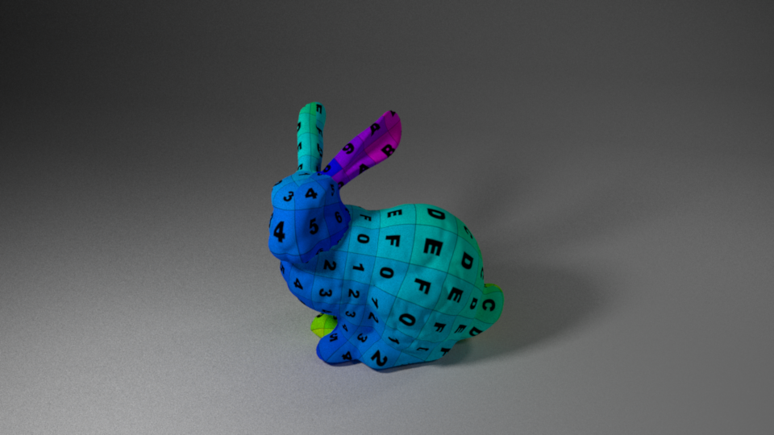
*Texture*

## Bump mapping

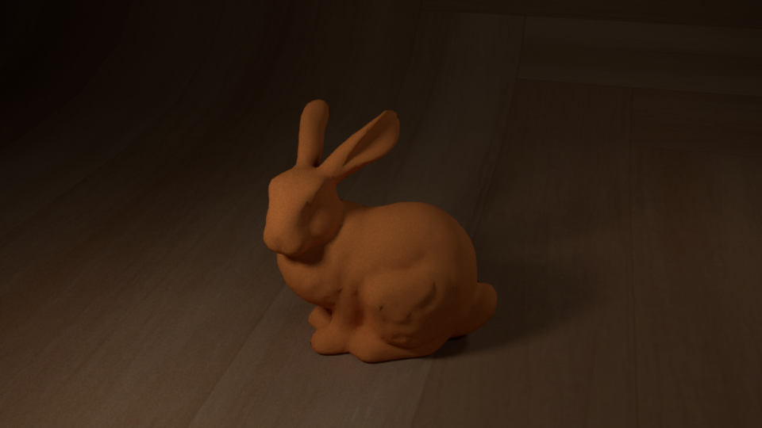
*Without bump mapping*

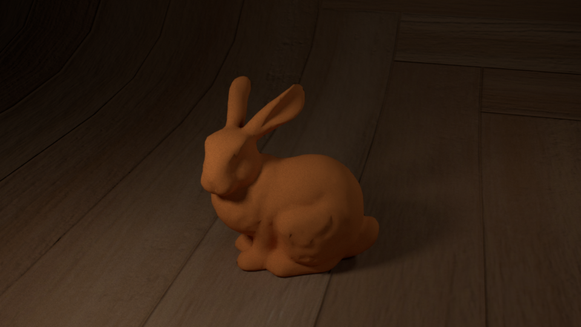
*With bump mapping*

## Depth of field

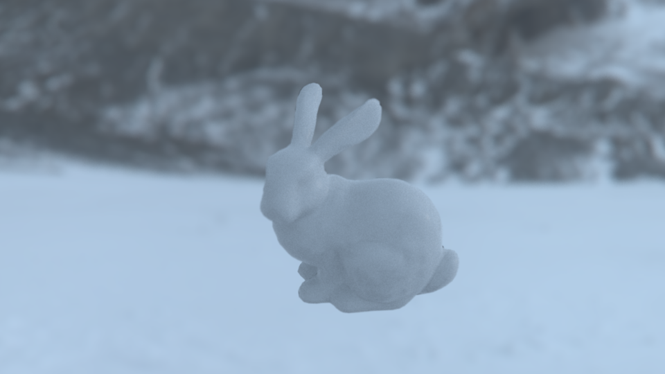
*Depth of field*

## Mix BSDF

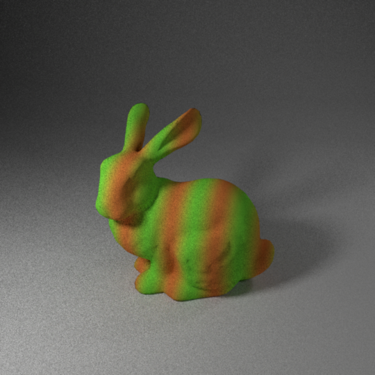

*Mix BSDF using the formula 1/2 (sin(2πx4)+1)*

## Image-based lighting

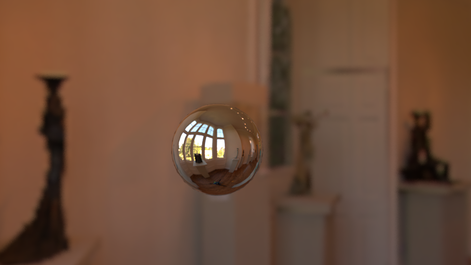
*Image-based lighting*

## Ray-intersection involving non-triangular shapes

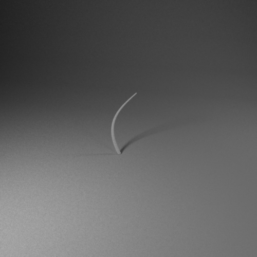

*A single Curve shape of type cylinder*

My Nori exporter (Blender plugin) can export automatically Cycle's Hair particles into Curve primitives.

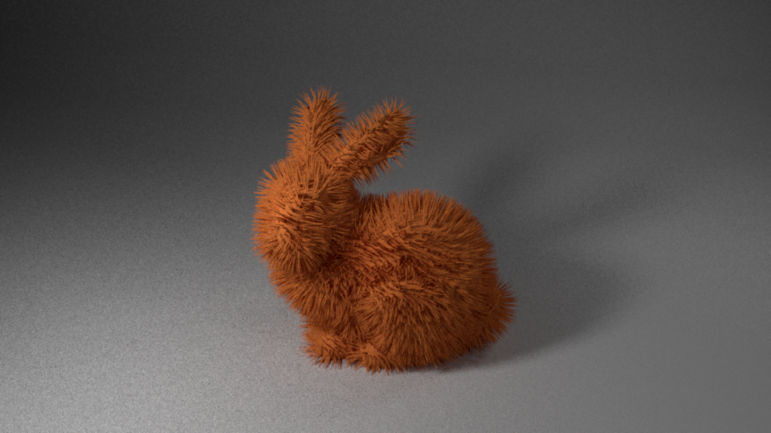
*Furry bunny using Curve primitives.*

## Subsurface scattering (SSS)

This implementation is based on the paper *A Rapid Hierarchical Rendering Technique for Translucent Materials*, Jensen, H.W. & Buhler, J. (2002), which combines the dipole approximation with a hierarchical data structure for an efficient evaluation of translucent material

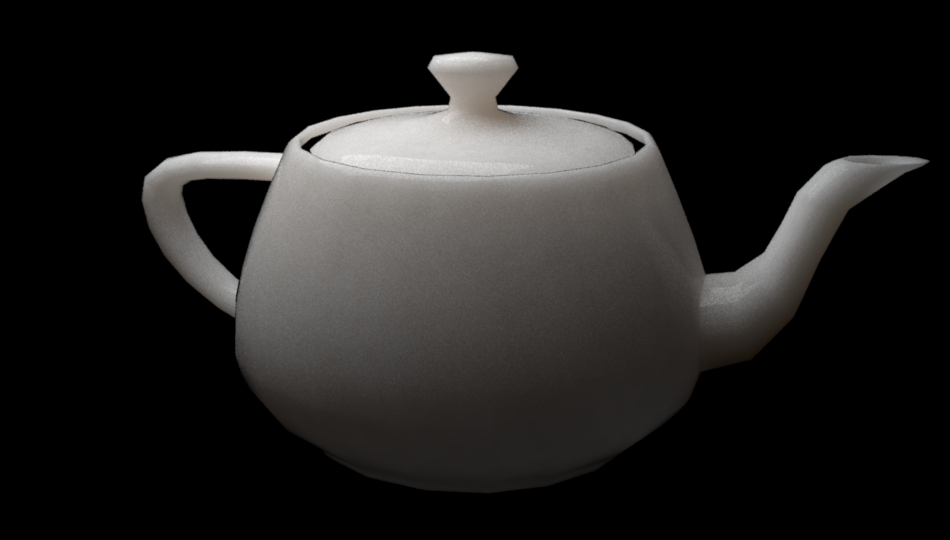
*Teapot*

By setting σ_a and σ_s to some measured values from real objects (see *A Practical Model for Subsurface Light Transport*), we can render Marble, Ketchup or Apple-like materials:

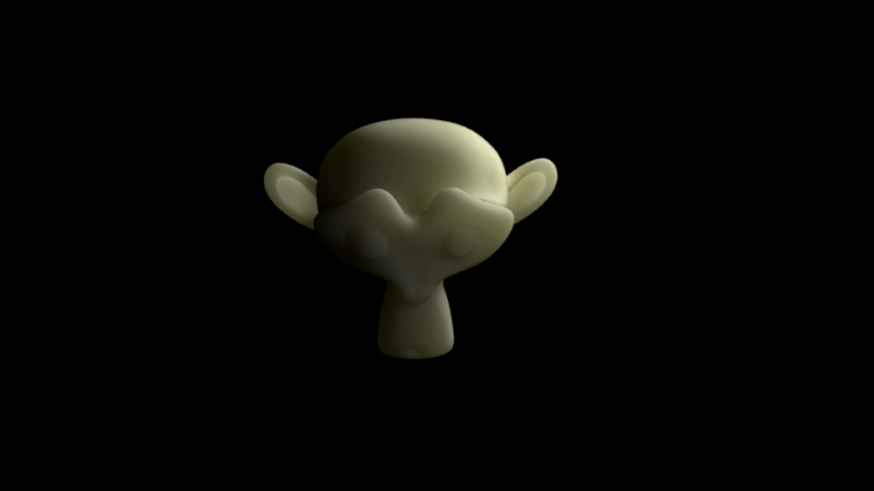
*Apple*

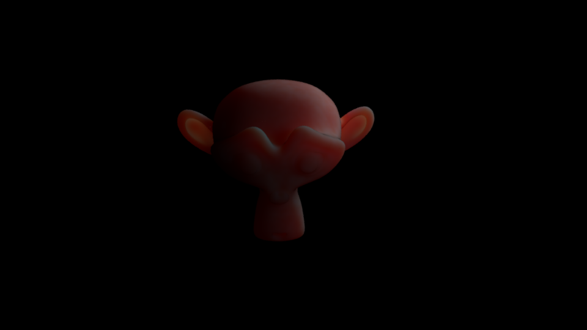
*Ketchup*

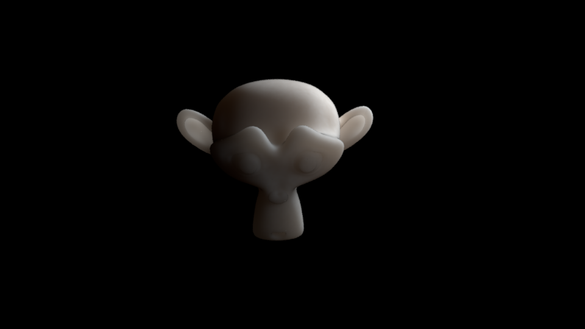
*Marble*

To validate this feature, we build a custom Student t-test with a carefully designed scene, where it is possible to compute the theoretical expected radiance received by a camera.

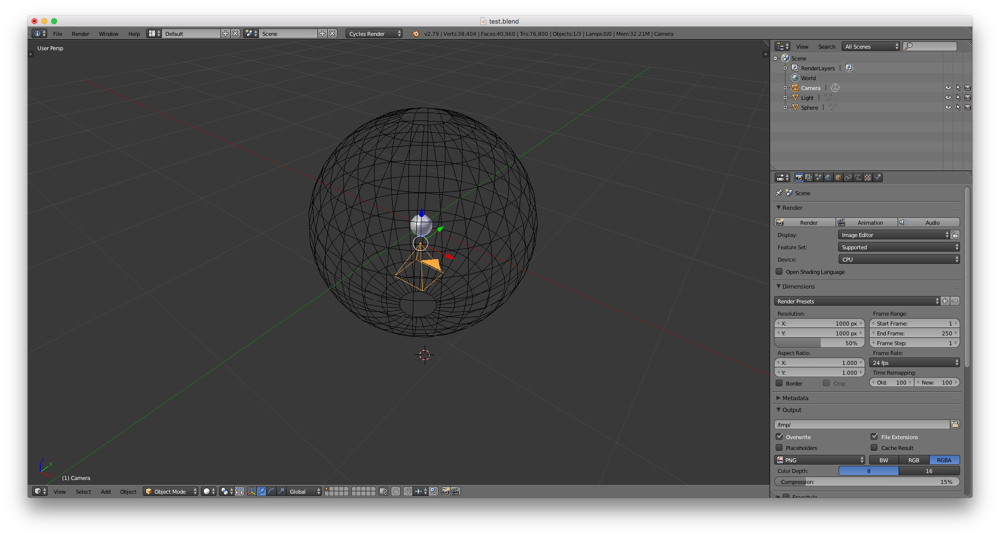
*Validation scene*

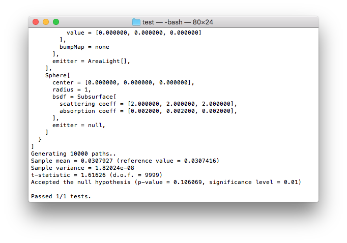

*Student t-test on the previously described scene*

## Final render

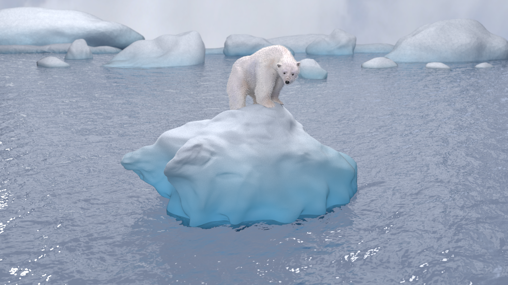
*My Final render including, textures, bump mapping, depth of field, fur, mix BSDF, image-based lighting and subsurface scattering.*
